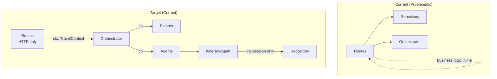

# Agentic Architecture Refactor

## Goal

Align the codebase with proper agentic architecture by leveraging the existing **Orchestrator/Planner/Agent** pattern instead of adding a traditional service layer. Make routes thin HTTP controllers that delegate to the Orchestrator. Apply domain-standard naming using **Reservation** terminology and **traveler_id**.

---

## Current vs Target Architecture



**Key:** `TravelContext` flows through Routes → Orchestrator → Agents. Repositories only receive `session`.

---

## Design Decisions

### DD-1: NL Interpretation Ownership

**Decision:** Move `interpret_nl_with_llm()` from `main.py` into the Orchestrator.

**Rationale:** Routes should not understand NL parsing. The Orchestrator is responsible for the full trip planning flow, which starts with interpreting the user's natural language query.

**Implementation:**
```python
# orchestrator.py
def plan_trip(self, query: str, ctx: TravelContext) -> PlanResult:
    ctx.original_query = query
    intent = self._interpret_query(query, ctx.llm)  # Moved from main.py
    tasks = plan_trip(intent, llm=ctx.llm)
    results = self._run_agents(intent, ctx)
    # ... persist itinerary
```

---

### DD-2: Shared Context Architecture

**Decision:** Introduce a `TravelContext` object that carries request-scoped and conversation-scoped data. Context is **mutable** and flows through Orchestrator and Agents. **Context stops at Agents** — Repositories only receive `session`.

---

#### TravelContext Structure

```python
# context.py
from dataclasses import dataclass, field
from typing import Optional, List

@dataclass
class TravelContext:
    """Mutable context shared across Orchestrator and Agents."""
    
    # === Request-scoped (always present) ===
    session: Session                      # DB access
    llm: Optional[LLMProvider]            # NL processing
    request_id: str                       # Logging correlation
    traveler_id: str                      # Who is making request
    criteria: SelectionCriteria           # Selection preference
    
    # === Conversation-scoped (loaded when itinerary_id provided) ===
    itinerary_id: Optional[str] = None
    itinerary: Optional[Itinerary] = None       # Current state
    original_query: Optional[str] = None
    chat_history: List[ChatMessage] = field(default_factory=list)
    
    # === Computed Properties ===
    @property
    def has_active_conversation(self) -> bool:
        return self.itinerary_id is not None
    
    @property
    def is_modification_flow(self) -> bool:
        return self.has_active_conversation and self.itinerary is not None
```

---

#### Context Scope

| Field | Scope | Source |
|-------|-------|--------|
| `session` | Request | FastAPI dependency |
| `llm` | Request | FastAPI dependency |
| `request_id` | Request | Header or generated UUID |
| `traveler_id` | Request | Request body |
| `criteria` | Request | Request body |
| `itinerary_id` | Conversation | URL param or created |
| `itinerary` | Conversation | Loaded from DB |
| `original_query` | Conversation | Stored in itinerary |
| `chat_history` | Conversation | Loaded from DB |

---

#### Context Boundary (Stops at Agents)

```
┌─────────────────────────────────────────────────────────┐
│                    Context-Aware                        │
│  ┌─────────┐    ┌──────────────┐    ┌────────────┐     │
│  │ Routes  │───▶│ Orchestrator │───▶│   Agents   │     │
│  └─────────┘    └──────────────┘    └─────┬──────┘     │
│                                           │            │
│         ctx: TravelContext (mutable)      │            │
└───────────────────────────────────────────┼────────────┘
                                            │ ctx.session only
┌───────────────────────────────────────────┼────────────┐
│                 Context-Unaware           ▼            │
│                              ┌──────────────────┐      │
│                              │   Repositories   │      │
│                              └────────┬─────────┘      │
│                                       ▼                │
│                              ┌──────────────────┐      │
│                              │     Database     │      │
│                              └──────────────────┘      │
└────────────────────────────────────────────────────────┘
```

**Rationale:**
- **Single Responsibility:** Repositories = data access only, no business context
- **Information Hiding:** Repos don't need `criteria`, `chat_history`, etc.
- **Testability:** Repos easy to test with just `session`
- **Dependency Inversion:** Don't leak high-level context to low-level infrastructure

---

#### Context Flow Examples

**New Trip Flow:**
```python
# routes.py
@router.post("/agent/plan")
def plan_trip(request: NaturalLanguageQueryRequest, ctx: TravelContext = Depends(get_context)):
    ctx.traveler_id = request.traveler_id
    ctx.criteria = request.selection_criteria or DEFAULT_SELECTION_CRITERIA
    return orchestrator.plan_trip(request.query, ctx)

# orchestrator.py
def plan_trip(self, query: str, ctx: TravelContext) -> PlanResult:
    ctx.original_query = query
    intent = self._interpret_query(query)
    
    # Agents receive mutable context
    flight = self.agents['FlightBookingAgent'].search(intent, ctx)
    hotel = self.agents['HotelBookingAgent'].search(intent, ctx)
    car = self.agents['CarRentalAgent'].search(intent, ctx)
    
    # ItineraryAgent persists and updates context
    itinerary = self.agents['ItineraryAgent'].build(flight, hotel, car, ctx)
    ctx.itinerary_id = itinerary.id
    ctx.itinerary = itinerary
    
    return PlanResult(...)
```

**Agent Using Context:**
```python
# flight_booking_agent.py
def search(self, intent: dict, ctx: TravelContext) -> dict:
    params = self._extract_params(intent)
    options = self._search_all(params)
    
    # Use criteria from context
    selected = self._select_best(options, ctx.criteria)
    
    # If updating existing itinerary, persist via repo (pass only session)
    if ctx.itinerary_id:
        repo = TravelItineraryRepository(ctx.session)
        repo.update_flight_reservation(ctx.itinerary_id, selected)
    
    return selected
```

**Modify Flow (loads conversation state):**
```python
# routes.py
@router.post("/itineraries/{itinerary_id}/modify")
def modify_itinerary(itinerary_id: str, request: ModifyRequest, ctx: TravelContext = Depends(get_context)):
    ctx.traveler_id = request.traveler_id
    ctx.itinerary_id = itinerary_id
    
    # Load conversation state into context
    repo = TravelItineraryRepository(ctx.session)
    ctx.itinerary = repo.get_by_id_or_raise(itinerary_id)
    ctx.original_query = ctx.itinerary.original_query
    
    chat_repo = ChatMessageRepository(ctx.session)
    ctx.chat_history = chat_repo.get_history(itinerary_id, limit=10)
    
    return orchestrator.modify_itinerary(request.instruction, ctx)
```

---

#### What's NOT in Context

| Excluded | Reason |
|----------|--------|
| App config | Global singleton, use config module |
| Logger instance | Use `get_logger()` with request_id filter |
| Repositories | Created by agents from `ctx.session` |
| Feature flags | Global, not conversation-specific |

---

### DD-3: Selection Logic Location

**Decision:** Move selection logic into the **individual agents**. Orchestrator passes criteria; agents return the best option.

**Rationale:** 
- Agents should be autonomous — given criteria, they should return the best match, not dump all options
- Each agent can apply **domain-specific** selection logic (e.g., FlightAgent considers layovers, HotelAgent considers amenities)
- Orchestrator stays thin — it coordinates, not decides
- Aligns with agentic principle: "Tell the agent what you want, not how to do it"

**Flow:**
```
Orchestrator.plan_trip(query, ctx)
    → FlightBookingAgent.search(params, ctx) → returns best flight
    → HotelBookingAgent.search(params, ctx) → returns best hotel
    → CarRentalAgent.search(params, ctx) → returns best car
    → ItineraryAgent.build(flight, hotel, car, ctx)
```

**Implementation:**
```python
# base_agent.py or each agent
def search(self, params: dict, ctx: TravelContext) -> dict:
    options = self._search_all(params)
    return self._select_best(options, ctx.criteria)

def _select_best(self, options: list, criteria: SelectionCriteria) -> dict:
    # Can be overridden for domain-specific logic
    if criteria == SelectionCriteria.CHEAPEST:
        return min(options, key=lambda x: x.get('price', float('inf')))
    elif criteria == SelectionCriteria.BEST_RATED:
        return max(options, key=lambda x: x.get('rating', 0))
    return options[0]  # FIRST_AVAILABLE
```

---

### DD-4: Status Transitions Ownership

**Decision:** Status transitions (`confirm`, `cancel`) are ItineraryAgent methods. Orchestrator provides pass-through methods.

**Rationale:** ItineraryAgent owns itinerary lifecycle. Orchestrator delegates without adding logic.

```python
# orchestrator.py
def confirm_itinerary(self, ctx: TravelContext) -> Itinerary:
    return self.agents['ItineraryAgent'].confirm(ctx)

# itinerary_agent.py
def confirm(self, ctx: TravelContext) -> Itinerary:
    repo = TravelItineraryRepository(ctx.session)
    return repo.confirm(ctx.itinerary_id)
```

---

### DD-5: In-Memory Mode

**Decision:** Deprecate in-memory mode. CLI will use SQLite (file-based DB).

**Rationale:** Maintaining two storage backends adds complexity. SQLite works for both CLI and web with no external dependencies.

---

### DD-6: Chat History Access

**Decision:** Chat history is loaded into `TravelContext` before calling Orchestrator (see DD-2 Context Flow Examples). Routes load `ctx.chat_history` from `ChatMessageRepository` for modify flows.

**Rationale:** The `modify_itinerary()` method needs conversation context to interpret instructions. By loading into context, Orchestrator and Agents can access it uniformly via `ctx.chat_history`.

```python
# orchestrator.py
def modify_itinerary(self, instruction: str, ctx: TravelContext) -> ModifyResult:
    # ctx.chat_history already loaded by route
    # Use it for context-aware interpretation
    prompt = self._build_modify_prompt(instruction, ctx.itinerary, ctx.chat_history)
    ...
```

---

### DD-7: Error Contract

**Decision:** Orchestrator raises domain exceptions. Routes catch and translate to HTTP responses.

| Domain Exception | HTTP Status |
|------------------|-------------|
| `ItineraryNotFoundError` | 404 |
| `VersionConflictError` | 409 |
| `InvalidStatusTransitionError` | 400 |
| `LLMUnavailableError` | 503 |

---

## Proposed Changes

### 1. Enhance `Orchestrator` ([orchestrator.py](file:///Users/udaykiranss/Technical/AgenticAI/TravelBooking/travel-agents/agents/orchestrator.py))

Add high-level methods that routes can call directly. **Move NL interpretation (`interpret_nl_with_llm`) inside the Orchestrator** so routes only pass raw query strings. All methods receive `TravelContext` (per DD-2).

| New Method | Purpose |
|------------|---------|
| `plan_trip(query, ctx)` | **Parse NL query to intent**, run agents, persist itinerary. Context provides criteria. |
| `modify_itinerary(instruction, ctx)` | NL modification flow. Context has itinerary + chat_history loaded. |
| `get_itinerary(ctx)` | Delegate to ItineraryAgent. Context has itinerary_id. |
| `confirm_itinerary(ctx)` | Status transition. Context has itinerary_id. |
| `cancel_itinerary(ctx)` | Status transition. Context has itinerary_id. |

---

### 2. Enhance `ItineraryAgent` ([itinerary_agent.py](file:///Users/udaykiranss/Technical/AgenticAI/TravelBooking/travel-agents/agents/itinerary_agent.py))

- Inject `TravelItineraryRepository` via constructor
- Move CRUD + status logic from routes into agent methods
- Handle optimistic locking, validation, and persistence

---

### 3. Selection Logic in Agents (per DD-3)

- Add `_select_best(options, criteria)` method to `BaseAgent` (can be overridden)
- Each booking agent (`FlightBookingAgent`, `HotelBookingAgent`, `CarRentalAgent`) applies selection during search
- Agents return **single best option** instead of all options
- Remove `select_best_option()` from routes entirely

---

### 4. Thin Routes ([routes.py](file:///Users/udaykiranss/Technical/AgenticAI/TravelBooking/travel-agents/api/routes.py))

Reduce each endpoint to:

1. Validate request
2. Populate context with request data
3. Call `Orchestrator` method with context
4. Return response

Example:

```python
@router.post("/agent/plan")
def plan_trip(
    request: NaturalLanguageQueryRequest, 
    ctx: TravelContext = Depends(get_context),
    orchestrator: Orchestrator = Depends(get_orchestrator)
):
    # Populate context from request
    ctx.traveler_id = request.traveler_id
    ctx.criteria = request.selection_criteria or DEFAULT_SELECTION_CRITERIA
    
    # Delegate to orchestrator
    return orchestrator.plan_trip(request.query, ctx)
```

---

### 5. Domain Naming

| Current | New |
|---------|-----|
| `flight_data` | `flight_reservation` |
| `hotel_data` | `hotel_reservation` |
| `car_data` | `car_reservation` |
| `ItineraryRepository` | `TravelItineraryRepository` |
| `ChatHistoryRepository` | `ChatMessageRepository` |

Update in:

- [models.py](file:///Users/udaykiranss/Technical/AgenticAI/TravelBooking/travel-agents/database/models.py)
- [repository.py](file:///Users/udaykiranss/Technical/AgenticAI/TravelBooking/travel-agents/database/repository.py)
- [schemas.py](file:///Users/udaykiranss/Technical/AgenticAI/TravelBooking/travel-agents/api/schemas.py)

---

### 6. Typed Mock Data

Create Pydantic models in `domain/travel_options.py`:

```python
class FlightOption(BaseModel):
    id: str
    origin: str  # was "from"
    destination: str  # was "to"
    date: str
    price: float
    airline: str
    ...
```

Update `data/flights.py`, `hotels.py`, `cars.py` to use these models.

---

## Files Changed Summary

| File | Change |
|------|--------|
| `api/context.py` | **[NEW]** `TravelContext` dataclass (per DD-2) |
| `agents/orchestrator.py` | Add plan_trip, modify_itinerary, etc. Accept `TravelContext`. Move `interpret_nl_with_llm` here. Fix duplicate return (line 124). |
| `agents/base_agent.py` | Add `_select_best(options, criteria)` method. Accept `TravelContext` in execute methods. |
| `agents/flight_booking_agent.py` | Accept `TravelContext`, use `ctx.criteria` for selection, return single best option |
| `agents/hotel_booking_agent.py` | Accept `TravelContext`, use `ctx.criteria` for selection, return single best option |
| `agents/car_rental_agent.py` | Accept `TravelContext`, use `ctx.criteria` for selection, return single best option |
| `agents/itinerary_agent.py` | Accept `TravelContext`. Use `ctx.session` for repo. Remove in-memory mode. Rename `*_booking` → `*_reservation`. |
| `agents/planner.py` | No changes |
| `api/routes.py` | Thin to HTTP-only. Populate context from request. Remove `select_best_option`. Add exception→HTTP mapping. |
| `api/dependencies.py` | Add `get_context()` dependency. Update `get_orchestrator()`. |
| `database/models.py` | Rename fields: `flight_data` → `flight_reservation`, etc. |
| `database/repository.py` | Rename: `ItineraryRepository` → `TravelItineraryRepository`, `ChatHistoryRepository` → `ChatMessageRepository`. Repos take only `session`. |
| `api/schemas.py` | Match new field names in request/response models |
| `domain/travel_options.py` | **[NEW]** Typed option models (FlightOption, HotelOption, CarOption) |
| `main.py` | Remove `interpret_nl_with_llm` (moved to Orchestrator) |
| `data/flights.py` | Use `FlightOption` model, rename `from` → `origin` |
| `data/hotels.py` | Use `HotelOption` model |
| `data/cars.py` | Use `CarOption` model |

---

## Verification Plan

### Automated

```bash
pytest -q tests/
```

### Manual

1. `POST /api/v1/agent/plan` → Verify `flight_reservation`, `hotel_reservation`, `car_reservation` in response
2. `GET /api/v1/itineraries/{id}` → Confirm status is `draft`
3. `POST /api/v1/itineraries/{id}/confirm` → Verify status changes
4. Concurrent update test → Expect `VERSION_CONFLICT`
5. Health check → DB and LLM status correct
