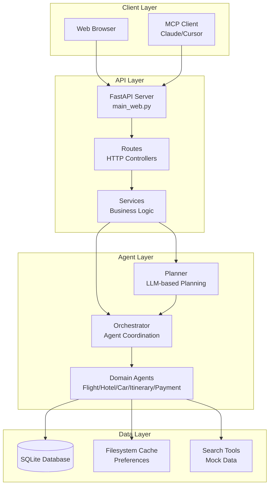
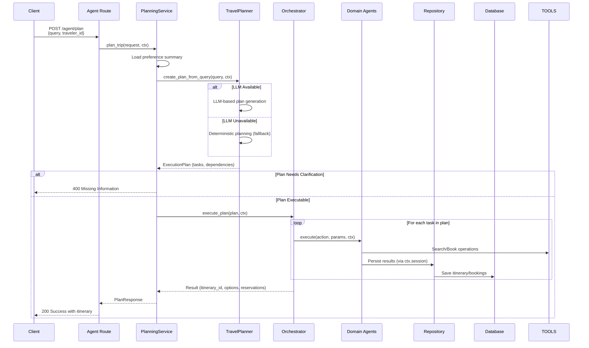
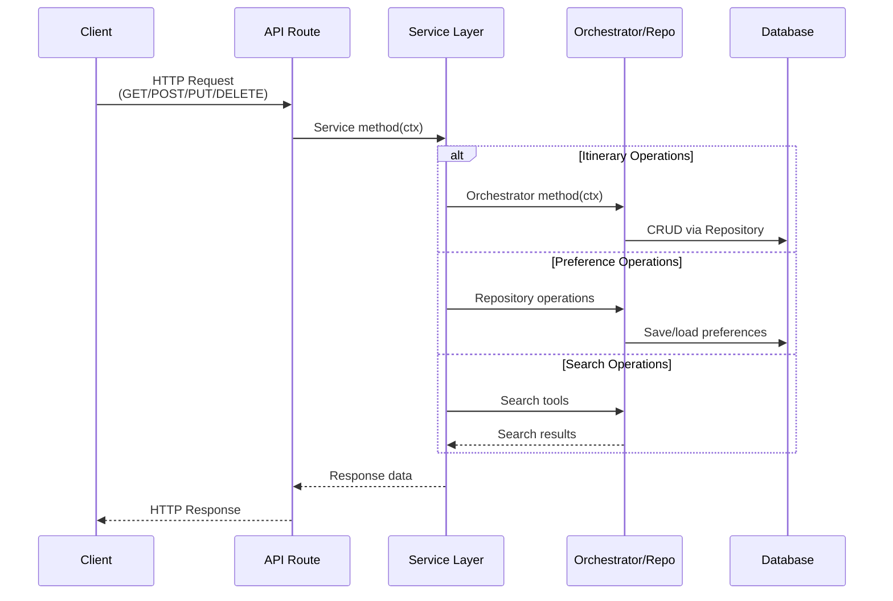
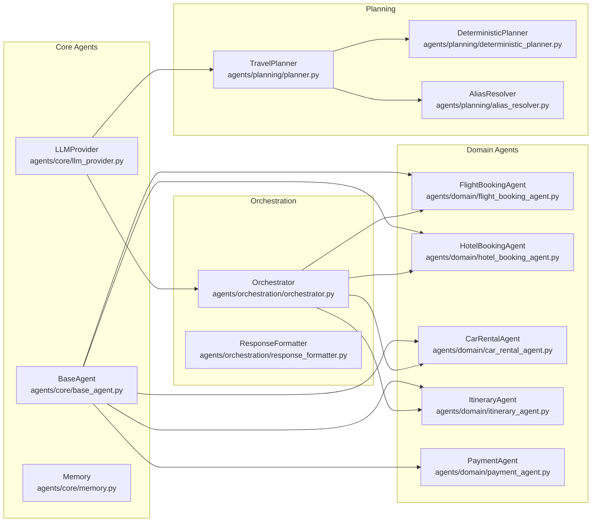
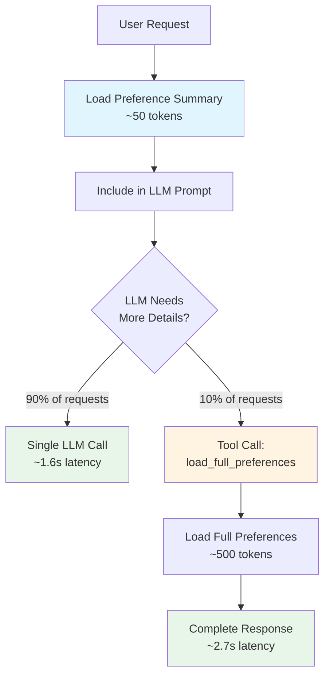
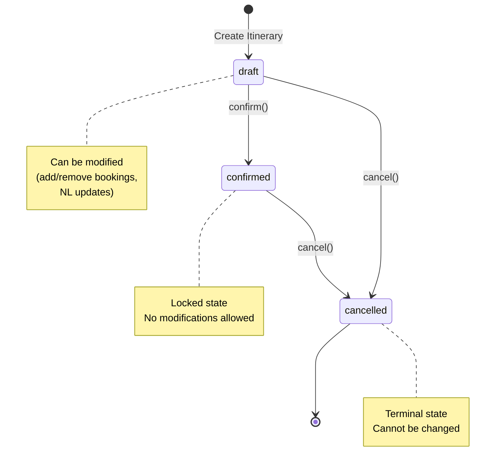
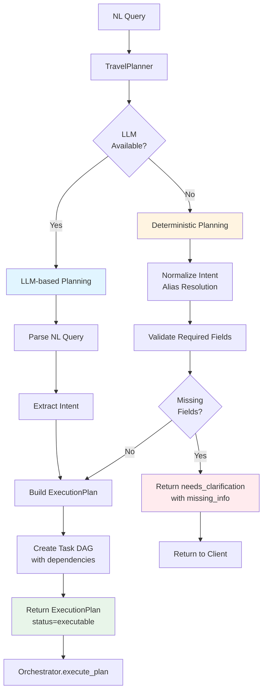

# Agentic Travel Booking System with LLM Integration

This system demonstrates a multi-agent architecture for travel booking with:
- **LLM-based intelligent planning** - Uses foundation models to select appropriate agents
- **Specialized agents** - Each agent handles a specific domain with multiple tools
- **Flexible LLM integration** - Supports any foundation model (OpenAI, Anthropic, Google, etc.)
- **Agent orchestration** - Coordinates multiple agents to fulfill complex user intents
- **Service layer** - Encapsulates business logic behind the API routes
- **User Preferences** - Personalized recommendations via tiered preference loading
- **REST API** - FastAPI-based web API for building frontend applications
- **Persistent Storage** - SQLite database with filesystem caching
- **MCP Server** - Direct integration with LLMs via Model Context Protocol

## Quick Start

```bash
# Setup
python -m venv .venv
source .venv/bin/activate  # Windows: .venv\Scripts\activate
pip install -r requirements.txt

# Set API key (optional, for LLM-based planning)
export OPENAI_API_KEY="your-api-key-here"
```

### Option 1: Web API

```bash
# Start the API server
python -m uvicorn main_web:app --reload --port 8000

# API Documentation
# Swagger UI: http://localhost:8000/docs
# ReDoc: http://localhost:8000/redoc
```

### Option 2: MCP Server (for Claude Desktop / Cursor)

The system includes a **Model Context Protocol (MCP)** server that allows LLMs (like Claude Desktop or Cursor Agent) to directly interact with your running API.

#### Prerequisites
- Python 3.10 or higher is required for the `mcp` package.
- The main API (`main_web.py`) must be running on port 8000.

#### Setup MCP Environment
Since the system python might be older (e.g., 3.9), create a dedicated venv with Python 3.11+:

```bash
# Install Python 3.11 (if needed)
brew install python@3.11

# Create venv
/opt/homebrew/bin/python3.11 -m venv venv311
source venv311/bin/activate

# Install dependencies
pip install "mcp[cli]" httpx fastapi uvicorn sqlmodel aiosqlite python-multipart python-dotenv
```

#### Running the Server
You can run the server manually to test:
```bash
/path/to/venv311/bin/python mcp/server.py
```

#### Configuration for Clients

**Claude Desktop App**:
Add to `~/Library/Application Support/Claude/claude_desktop_config.json`:
```json
{
  "mcpServers": {
    "travel-agent": {
      "command": "/absolute/path/to/venv311/bin/python",
      "args": [
        "/absolute/path/to/project/mcp/server.py"
      ]
    }
  }
}
```

**Cursor**:
1. Go to **Settings > General > MCP Servers**.
2. Click **Add new MCP server**.
3. Name: `travel-agent`
4. Type: `stdio`
5. Command: `/absolute/path/to/venv311/bin/python`
6. Args: `/absolute/path/to/project/mcp/server.py`

---

## Architecture

### System Overview



### Core Components

1. **LLM Provider** (`agents/core/llm_provider.py`)
   - Flexible abstraction supporting multiple foundation models
   - Supports OpenAI, Anthropic, Google, and other providers via LangChain
   - Handles structured output generation

2. **Planner** (`agents/planning/planner.py`)
   - **LLM-based planning**: Uses foundation models to intelligently select agents and tasks
   - **Deterministic fallback**: Works without LLM for basic scenarios
   - Converts user intents into structured `ExecutionPlan` with task DAGs
   - Includes alias resolution for city/airport names

3. **Orchestrator** (`agents/orchestration/orchestrator.py`)
   - Coordinates multiple specialized agents
   - Executes `ExecutionPlan` tasks in dependency order
   - Manages `TravelContext` flow to agents
   - Handles preference loading and tool execution
   - Delegates status transitions to ItineraryAgent

4. **TravelContext** (`api/context.py`)
   - Shared mutable context flowing through Routes → Services → Orchestrator → Agents
   - Carries request-scoped data (session, LLM, traveler_id, criteria)
   - Carries conversation-scoped data (itinerary, chat_history, preferences)
   - **Stops at Agents** — Repositories only receive `session`

5. **Service Layer** (`api/services/`)
   - Encapsulates business logic for itineraries, preferences, search, health, conversation, and planning
   - Keeps routes thin and testable; services coordinate with Orchestrator/Repositories
   - Services: `PlanningService`, `ItineraryService`, `PreferenceService`, `SearchService`, `HealthService`, `ConversationService`

6. **Web API** (`api/`, `main_web.py`)
   - **Thin HTTP controllers** that delegate to Services
   - FastAPI-based REST API with Swagger/OpenAPI
   - SQLite persistence layer
   - Request ID middleware for traceability
   - CORS support for frontend integration

7. **MCP Server** (`mcp/server.py`)
   - Exposes API capabilities as **Tools** (actions) and **Resources** (read-only context)
   - Allows LLMs to plan trips, modify itineraries, and check status directly
   - Includes full request tracing and logging integration

### Request Flow

#### Planning Flow (Natural Language Trip Planning)



#### Non-Planning Flows (CRUD Operations)



### Agent Organization



### Specialized Agents

Each agent is a self-contained unit with multiple tools:

| Agent | Location | Tools | Purpose |
|-------|----------|-------|---------|
| **FlightBookingAgent** | `agents/domain/flight_booking_agent.py` | `search_flights`, `compare_flights`, `book_flight` | Flight operations |
| **HotelBookingAgent** | `agents/domain/hotel_booking_agent.py` | `search_hotels`, `compare_hotels`, `book_hotel` | Hotel search & booking |
| **CarRentalAgent** | `agents/domain/car_rental_agent.py` | `search_cars`, `compare_cars`, `book_car` | Car rental operations |
| **ItineraryAgent** | `agents/domain/itinerary_agent.py` | `build_itinerary`, `update_itinerary`, `get_itinerary`, `list_itineraries`, `confirm`, `cancel` | Travel itinerary management |
| **PaymentAgent** | `agents/domain/payment_agent.py` | `process_payment`, `verify_payment` | Payment processing |

### Selection Criteria

Agents automatically select the best option based on criteria passed via `TravelContext`:

| Criteria | Behavior |
|----------|----------|
| `first_available` | Returns first matching option (fastest) |
| `cheapest` | Selects option with lowest price |
| `best_rated` | Selects highest-rated option |

```bash
# Example: Request cheapest options
curl -X POST http://localhost:8000/api/v1/agent/plan \
  -H "Content-Type: application/json" \
  -d '{
    "query": "Flight from NYC to LAX",
    "traveler_id": "user_123",
    "selection_criteria": "cheapest"
  }'
```

### User Preferences (Tiered Loading)

The system uses a **tiered preference loading pattern** for personalized recommendations:



**Benefits:**
- **90% of requests**: Single LLM call with compact summary
- **10% of requests**: Tool call for detailed preferences
- **Average latency**: ~1.6s (vs ~2.7s for always-load approach)

---

## Web API Reference

### Base URL
```
http://localhost:8000/api/v1
```

### Endpoints

#### Itinerary Management

| Method | Endpoint | Description |
|--------|----------|-------------|
| `POST` | `/itineraries` | Create a new draft itinerary |
| `GET` | `/itineraries` | List itineraries (with pagination & filters) |
| `GET` | `/itineraries/{id}` | Get itinerary by ID |
| `PUT` | `/itineraries/{id}` | Update itinerary (with optimistic locking) |
| `DELETE` | `/itineraries/{id}` | Delete a draft itinerary |

#### Status Management

| Method | Endpoint | Description |
|--------|----------|-------------|
| `POST` | `/itineraries/{id}/confirm` | Confirm a draft (locks editing) |
| `POST` | `/itineraries/{id}/cancel` | Cancel an itinerary |

#### LLM Operations

| Method | Endpoint | Description |
|--------|----------|-------------|
| `POST` | `/agent/plan` | Generate travel options from NL query |
| `POST` | `/itineraries/{id}/modify` | Modify itinerary via natural language |

#### User Preferences

| Method | Endpoint | Description |
|--------|----------|-------------|
| `GET` | `/preferences/{traveler_id}` | Get full preferences |
| `PUT` | `/preferences/{traveler_id}` | Create/update preferences (upsert) |
| `DELETE` | `/preferences/{traveler_id}` | Delete preferences |
| `GET` | `/preferences/{traveler_id}/summary` | Get compact summary (~50 tokens) |

#### System

| Method | Endpoint | Description |
|--------|----------|-------------|
| `GET` | `/health` | Health check (DB & LLM status) |

### Example: Create and Confirm an Itinerary

```bash
# 1. Create a draft itinerary
curl -X POST http://localhost:8000/api/v1/itineraries \
  -H "Content-Type: application/json" \
  -d '{"traveler_id": "user_123", "original_query": "Trip to Paris"}'

# Response: {"id": "itin-abc123", "status": "draft", "version": 1, ...}

# 2. Add flight booking
curl -X PUT http://localhost:8000/api/v1/itineraries/itin-abc123 \
  -H "Content-Type: application/json" \
  -d '{"version": 1, "flight_data": {"airline": "Air France", "price": 500}}'

# 3. Confirm the itinerary
curl -X POST http://localhost:8000/api/v1/itineraries/itin-abc123/confirm

# Response: {"id": "itin-abc123", "status": "confirmed", ...}
```

### Status Workflow



- **draft**: Can be modified (add/remove bookings, NL updates)
- **confirmed**: Locked, no modifications allowed
- **cancelled**: Terminal state

### Optimistic Locking

Updates require a `version` field to prevent lost updates:

```json
PUT /api/v1/itineraries/{id}
{
  "version": 2,
  "flight_data": {...}
}
```

If the version doesn't match, you'll receive a `409 Conflict` response.

---

## Database Schema

The API uses SQLite with three main tables:

### `itinerary` Table

| Column | Type | Description |
|--------|------|-------------|
| `id` | TEXT (PK) | UUID identifier (e.g., "itin-abc123") |
| `traveler_id` | TEXT | Traveler identifier |
| `original_query` | TEXT | Original NL query |
| `status` | TEXT | draft, confirmed, cancelled |
| `flight_reservation` | JSON | Flight booking details |
| `hotel_reservation` | JSON | Hotel booking details |
| `car_reservation` | JSON | Car rental details |
| `total_cost` | REAL | Computed total |
| `version` | INTEGER | Optimistic locking version |
| `created_at` | TIMESTAMP | Creation time |
| `updated_at` | TIMESTAMP | Last modification |

### `chat_history` Table

| Column | Type | Description |
|--------|------|-------------|
| `id` | TEXT (PK) | Message UUID |
| `itinerary_id` | TEXT (FK) | Associated itinerary |
| `role` | TEXT | "user" or "assistant" |
| `content` | TEXT | Message content |
| `created_at` | TIMESTAMP | Message time |

### `user_preferences` Table

| Column | Type | Description |
|--------|------|-------------|
| `traveler_id` | TEXT (PK) | Traveler identifier |
| `flight_preferences` | JSON | Seat type, cabin class, airlines |
| `hotel_preferences` | JSON | Min rating, room type, amenities |
| `car_preferences` | JSON | Car type, features, companies |
| `budget_range` | JSON | Min/max budget, currency |
| `dietary_restrictions` | JSON | List of dietary needs |
| `accessibility_needs` | JSON | List of accessibility requirements |
| `loyalty_programs` | JSON | List of program memberships |
| `past_bookings_summary` | JSON | Aggregated booking stats |
| `created_at` | TIMESTAMP | Creation time |
| `updated_at` | TIMESTAMP | Last modification |

**Filesystem Cache:** Preferences are cached at `data/user_preferences/{traveler_id}.json` for fast tool reads (~5ms).

---

## Project Structure

```
travel-agents/
├── agents/
│   ├── __init__.py
│   ├── core/                      # Core agent infrastructure
│   │   ├── __init__.py
│   │   ├── base_agent.py          # Base class for all agents
│   │   ├── llm_provider.py        # LLM integration abstraction
│   │   ├── memory.py              # Memory/conversation management
│   │   └── router.py              # Legacy router
│   ├── domain/                    # Domain-specific agents
│   │   ├── __init__.py
│   │   ├── flight_booking_agent.py
│   │   ├── hotel_booking_agent.py
│   │   ├── car_rental_agent.py
│   │   ├── itinerary_agent.py    # DB-aware itinerary management
│   │   └── payment_agent.py
│   ├── orchestration/             # Agent coordination
│   │   ├── __init__.py
│   │   ├── orchestrator.py        # Main orchestrator
│   │   └── response_formatter.py  # LLM response formatting
│   └── planning/                  # Planning logic
│       ├── __init__.py
│       ├── planner.py             # Main TravelPlanner
│       ├── deterministic_planner.py  # Fallback planner
│       ├── alias_resolver.py     # City/airport alias resolution
│       └── schemas.py            # ExecutionPlan schemas
├── api/
│   ├── __init__.py
│   ├── config.py                 # Configuration constants
│   ├── context.py                # TravelContext dataclass
│   ├── dependencies.py           # FastAPI DI bindings
│   ├── schemas.py                # Pydantic request/response models
│   ├── routes/                   # Modular FastAPI routers
│   │   ├── __init__.py           # Registers all sub-routers
│   │   ├── health.py             # /health
│   │   ├── search.py             # /search/*
│   │   ├── itineraries.py        # /itineraries/*
│   │   ├── preferences.py        # /preferences/*
│   │   └── agent.py             # /agent/plan, /itineraries/{id}/modify
│   ├── services/                 # Service layer (business logic)
│   │   ├── __init__.py
│   │   ├── itinerary_service.py
│   │   ├── preference_service.py
│   │   ├── search_service.py
│   │   ├── health_service.py
│   │   ├── conversation_service.py
│   │   └── planning_service.py
│   └── utils/                    # Shared helpers
│       ├── __init__.py
│       └── response_utils.py
├── database/
│   ├── __init__.py
│   ├── models.py                 # SQLModel ORM (Itinerary, UserPreferences, ChatHistory)
│   ├── connection.py             # DB connection & table creation
│   └── repository.py             # CRUD + preference cache sync
├── tools/
│   ├── search_tools.py           # Flight, hotel, car search tools
│   ├── preference_tools.py       # load_full_preferences tool
│   └── payment_tool.py           # Payment processing tool
├── data/
│   ├── flights.py                # Mock flight data
│   ├── hotels.py                 # Mock hotel data
│   ├── cars.py                   # Mock car data
│   ├── city_airport_aliases.json  # City/airport alias mapping
│   └── user_preferences/         # Filesystem cache for preferences
│       ├── user_123.json         # Sample preferences
│       └── user_456.json         # Sample preferences
├── docs/                         # Architecture documentation
│   ├── AGENTIC_REFACTOR_PLAN.md
│   ├── ARCHITECTURE_REUSE_PROMPT.md
│   ├── FEATURE_VERIFICATION.md
│   ├── LOGGING.md
│   ├── PLAN_TRIP_API_FLOW.md
│   ├── PLANNER_DAG_DESIGN.md
│   ├── PLANNER_FALLBACK_ANALYSIS.md
│   ├── PLANNER_REFACTOR.md
│   ├── REUSING_PROJECT_STRUCTURE.md
│   ├── USER_PREFERENCES_PLAN.md
│   └── WebApp-Impl-Plan*.md
├── tests/
│   ├── conftest.py               # Pytest fixtures
│   ├── test_api.py               # API integration tests
│   ├── test_agents/               # Agent unit tests
│   │   ├── test_flight_agent.py
│   │   ├── test_hotel_agent.py
│   │   ├── test_car_agent.py
│   │   ├── test_itinerary_agent.py
│   │   └── test_payment_agent.py
│   ├── test_core/                 # Core component tests
│   │   ├── test_orchestrator.py
│   │   └── test_planner.py
│   ├── test_integration/          # End-to-end flow tests
│   │   └── test_flows.py
│   └── test_services/            # Service layer unit tests
│       ├── conftest.py
│       ├── test_itinerary_service.py
│       ├── test_preference_service.py
│       ├── test_search_service.py
│       ├── test_health_service.py
│       ├── test_conversation_service.py
│       └── test_planning_service.py
├── utils/
│   ├── __init__.py
│   └── logger.py                  # Comprehensive logging system
├── mcp/
│   └── server.py                  # MCP Server implementation
├── main_web.py                    # FastAPI entry point
├── requirements.txt              # Python dependencies
├── pyrightconfig.json            # Type checking config
└── README.md                      # This file
```

---

## Configuration

### Environment Variables

| Variable | Default | Description |
|----------|---------|-------------|
| `OPENAI_API_KEY` | - | OpenAI API key (required for LLM features) |
| `LLM_MODEL` | `gpt-4o` | Model name |
| `LLM_PROVIDER` | `openai` | Model provider |
| `LLM_TIMEOUT` | `60` | Timeout for LLM operations (seconds) |
| `PORT` | `8000` | API server port |
| `HOST` | `0.0.0.0` | API server host |
| `ALLOWED_ORIGINS` | `http://localhost:3000,http://localhost:5173` | CORS origins |
| `DEBUG` | - | Enable debug mode (shows exception details) |
| `LOG_LEVEL` | `INFO` | Logging level |
| `PREFERENCE_LOADING_MODE` | `summary` | Preference loading: `summary` (fast) or `tool_binding` (LLM can fetch details) |

### Example `.env` file

```env
OPENAI_API_KEY=sk-your-key-here
LLM_MODEL=gpt-4o
LLM_PROVIDER=openai
LOG_LEVEL=DEBUG
```

---

## Testing

Run the test suites:

```bash
# Run API tests
python -m pytest tests/test_api.py -v

# Run service layer tests
python -m pytest tests/test_services/ -v

# Run agent tests
python -m pytest tests/test_agents/ -v

# Run core component tests
python -m pytest tests/test_core/ -v

# Run integration tests
python -m pytest tests/test_integration/ -v

# Run everything
python -m pytest tests/ -v

# Run with coverage (API + services)
python -m pytest tests/test_api.py tests/test_services/ --cov=api --cov=api/services --cov-report=html
```

Test coverage includes:
- API flows (CRUD, status transitions, optimistic locking, pagination/filtering)
- LLM operations (with mocking)
- Service layer business logic (itineraries, preferences, search, health, conversation, planning)
- Agent unit tests (all domain agents)
- Core component tests (orchestrator, planner)
- Integration tests (full workflows)

---

## Example Usage

### CLI Usage

```python
from agents.orchestration import Orchestrator
from agents.core.llm_provider import create_llm_provider

# Initialize with LLM
llm = create_llm_provider(model_name="gpt-4o", model_provider="openai")
orch = Orchestrator(llm=llm)

# Execute user intent
intent = {
    'needs': ['flight', 'hotel'],
    'from': 'NYC',
    'to': 'LON',
    'date': '2025-08-12'
}

results = orch.run_intent(intent)
```

### API Usage (Python)

```python
import httpx

BASE_URL = "http://localhost:8000/api/v1"

# Create itinerary
response = httpx.post(f"{BASE_URL}/itineraries", json={
    "traveler_id": "user_123",
    "original_query": "Weekend trip to Paris"
})
itinerary = response.json()

# Add flight
httpx.put(f"{BASE_URL}/itineraries/{itinerary['id']}", json={
    "version": 1,
    "flight_data": {"airline": "Air France", "price": 450}
})

# Confirm
httpx.post(f"{BASE_URL}/itineraries/{itinerary['id']}/confirm")
```

### User Preferences API

```bash
# 1. Create/update user preferences
curl -X PUT http://localhost:8000/api/v1/preferences/user_123 \
  -H "Content-Type: application/json" \
  -d '{
    "flight_preferences": {
      "seat_type": "aisle",
      "cabin_class": "economy_plus",
      "preferred_airlines": ["Delta", "United"]
    },
    "hotel_preferences": {
      "min_rating": 4,
      "amenities": ["wifi", "gym"]
    },
    "budget_range": {
      "min": 1000,
      "max": 3000,
      "currency": "USD"
    },
    "dietary_restrictions": ["vegetarian"],
    "loyalty_programs": [
      {"program": "Delta SkyMiles", "number": "123456789", "tier": "Gold"}
    ]
  }'

# 2. Get preference summary (fast, for prompts)
curl http://localhost:8000/api/v1/preferences/user_123/summary
# Response: {"traveler_id": "user_123", "summary": "Prefers: flights: economy_plus, aisle seat; hotels: 4+ star; budget: USD 1000-3000"}

# 3. Get full preferences
curl http://localhost:8000/api/v1/preferences/user_123

# 4. Plan trip (preferences are automatically loaded)
curl -X POST http://localhost:8000/api/v1/agent/plan \
  -H "Content-Type: application/json" \
  -d '{
    "query": "Plan a trip from NYC to LAX next Friday",
    "traveler_id": "user_123"
  }'
# Response includes: "preference_summary": "Prefers: flights: economy_plus, aisle seat; ..."
```

---

## Domain Conventions

### Naming

The codebase uses **Reservation** terminology for booked items:

| Field | Description |
|-------|-------------|
| `flight_reservation` | Booked flight details |
| `hotel_reservation` | Booked hotel details |
| `car_reservation` | Booked car rental details |
| `traveler_id` | Identifier for the person booking |

### Error Handling

Domain exceptions are raised by Orchestrator/Agents and translated to HTTP by routes:

| Domain Exception | HTTP Status | Description |
|------------------|-------------|-------------|
| `ItineraryNotFoundError` | 404 | Itinerary doesn't exist |
| `VersionConflictError` | 409 | Optimistic locking conflict |
| `InvalidStatusTransitionError` | 400 | Invalid status change |
| `LLMUnavailableError` | 503 | LLM service not available |
| `PreferencesNotFoundError` | 404 | User preferences not found |

---

## Planning Architecture

### Execution Plan Structure

The planner generates `ExecutionPlan` objects with the following structure:

```mermaid
graph TD
    PLAN[ExecutionPlan] --> STATUS[status:<br/>executable/needs_clarification]
    PLAN --> TASKS[tasks: List[Task]]
    PLAN --> METADATA[plan_metadata:<br/>PlanMetadata]
    PLAN --> MISSING[missing_info:<br/>List[MissingInfo]]
    
    TASK[Task] --> ID[task_id: str]
    TASK --> AGENT[agent: str<br/>FlightBookingAgent]
    TASK --> ACTION[action: str<br/>search_flights]
    TASK --> PARAMS[params: Dict]
    TASK --> DEPS[dependencies: List[str]]
    TASK --> SCHEMA[output_schema: Dict]
    TASK --> PARALLEL[parallelizable: bool]
    
    TASKS --> TASK
```

### Planning Flow



---

## Logging

The system includes comprehensive logging with:
- **Request ID tracking** - Every request gets a unique ID for correlation
- **Structured logging** - JSON-formatted logs with context
- **Multiple outputs** - Console and file logging
- **Performance tracking** - Request duration and method timing
- **Session context** - Automatic context propagation

Logs are written to:
- Console (stdout) - Human-readable format
- `logs/travel_booking.log` - File with full details

See `docs/LOGGING.md` for detailed logging documentation.

---

## License

This project is provided as-is for educational and demonstration purposes.
